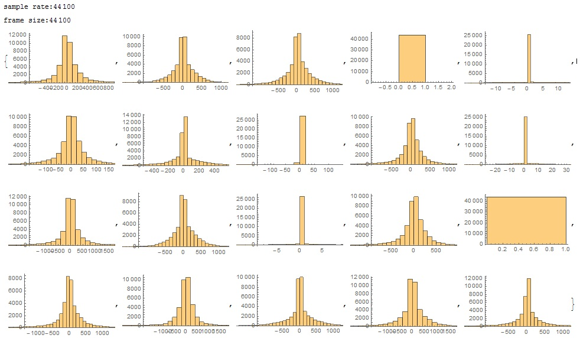
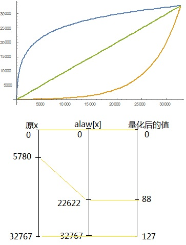
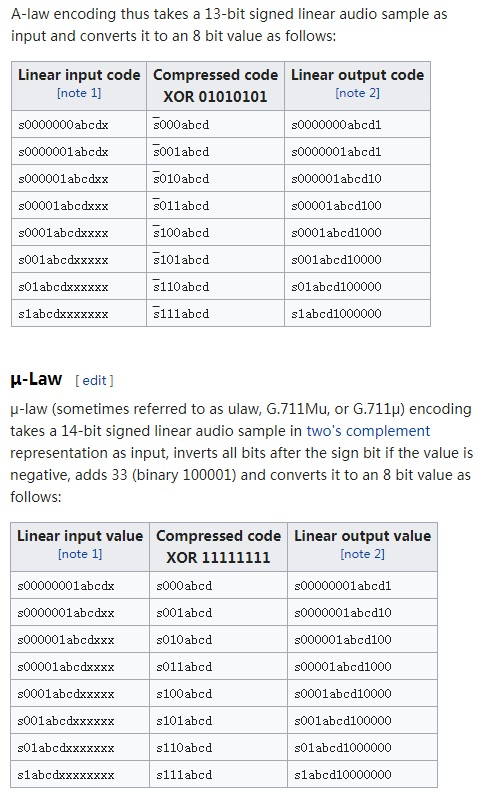

# 自己实现DPCM编码 #

## step1：观察差值分布 ##

挑一段音频，随机抽取一秒的一组pcm数据，检查相邻两个short型采样值的差值的分布情况:

	pcm = Import["d:\\005.mp3"];
	ch=pcm[[1]][[1]][[1]];
	sr=pcm[[1]][[2]];
	Print["sample rate:", sr];
	len=Length[ch];
	data=Table[1, {i, 1,20}];
	frameSz=sr;
	Print["frame size:",frameSz];
	Do[
		start=RandomInteger[{1,len-sr}];
		data[[j]]=Table[Round[ch[[start+i]]*37767]-Round[ch[[start+i-1]]*37767], 
				{i, 2,frameSz}],
		{j,1,20}
	];
	Table[Histogram[ data[[j]] ], {j, 1, 20}]

结果为：

可以看到：

1. 近似正态分布,分布比较集中在中心点：0是中值和均值，多数情况下标准差比较大，超过100.
2. 我准备用4bit来编码这些差值，也就是编码数字为-8~7；且覆盖左右两个标准差内的点，两个标准差之外的点都截断为-7和7。那么量化步长多数情况下大于100*2/7=29。

## step2：设计与实现 ##

我设计一个DPCM压缩格式，代码在my_codec_4bit_dpcm.c中，协议如下：

1. 每一秒的pcm作为一帧，一个音频文件由多个帧组成
2. 每帧由帧头和数据部分组成
3. 每帧的帧头保存采样率、声道数、量化步长、该帧的第一个采样值(16bit)等基础信息
4. 每帧的数据部分，保存相邻采样间差值，即每个PCM与前一个PCM的差值。该差值是一个4bit的商，即pcm差值除以量化步长所得的商，可正可负。

测试后发现，音频的还原效果挺好的。

同样的，我也试了一下：

1. 用8bit来编码相邻两个采样的差值，代码在my\_codec\_8bit\_dpcm.c中
2. 用8bit来编码每个采样的值，代码在my\_codec\_8bit\_pcm.c中

还原的音质都还可以。

## step3:非均匀量化 ##

对于上面DPCM的设计，已经有一定程度上考虑非均匀量化了：

每一帧都会分析差值的分布，从而决定一个合理的量化步长，对于差值比较小的帧，量化步长也会比较小。

但是如果是将16bit PCM样本直接压缩为8bit PCM，或者直接将16bit PCM间差值压缩为4bit，可以用mu律或者A律做进一步的非均匀量化，优化信噪比。

my\_codec\_8bit\_pcm.c中有引入非均匀量化，主观测试能感受到噪声小一些。

下面是mu律的具体实现：

假设将0-32767范围的值，先经过mulaw映射到0-32767范围，然后量化到0-127之间的值。

我发现mu律对于大多数绝对值小的信号，可以有更好的信噪比，但对于个别的小信号，比均匀编码更差。

一开始我以为是我的公式不对，但参考wiki上的分段查表法也是一样的结果：

	alaw[x_]:= Log[1+255(x/32767)]/Log[1+255] * 32767;
	ialaw[x_]:= (Exp[x/32767*Log[1+255]]-1)/255*32767;
	Plot[{alaw[x], ialaw[x],x}, {x, 0, 32767}]

	answer = Solve[alaw'[x] ==1];
	x0=answer[[1]][[1]][[2]];
	Print[N[x0]]; (* x0 is seperated point*)

	ok = 0;
	Do[
		value=i;
		err1 = Abs[value - Round[value/64]*64];
		err2 =Abs[value - ialaw[Round[alaw[value]/64]*64]];
		If[err1>err2, ok=ok+1, null],
		{i, 0, Floor[x0]}
	];
	Print["ok=", ok, ",  ", N[ok/x0]]

可以看到：

1. 0到5780这段“小值”被扩大到0-22622范围，而5780到32767这段“大值”被压缩到22622-32767范围
2. 0到5780这5781个“小值”， 有75%左右的因为mu律的压扩而受益，即量化误差变小，但有25%的“小值”量化误差反而变大了。

以为是我上面的mathematica代码不对，使用[wiki](https://en.wikipedia.org/wiki/G.711)里的查表法做压扩和编码，也是这个结果：

测试用的c代码直接放出来：

	int mulaw(int x)
	{
	    int s = 0;
	    if (x < 0) { x = -x; s = 1;} 
	
	    uint32_t mask = 0xFFE0;
	    uint32_t result = 0x20;
	    uint32_t mask2 = 0x1e;
	
	
	    int i;
	    for (i = 0; i < 8; i++)
	    {   
	        if ( (x & mask) == result || (x & mask) == 0)
	        {       
	            int ret = ((x&mask2) >> (i+1)) |  (i<<4);
	            if (s)      
	            {           
	                ret = -ret;     
	            }           
	            return ret; 
	
	        }       
	        mask = (mask << 1);
	        result = (result <<1);
	        mask2 = (mask2 << 1);
	    }   
	    printf("%s:x=0x%x, exit!\n", __FUNCTION__, x); 
	    exit(-1);
	}
	int imulaw(int x)
	{
	    int s = 0;
	    if (x < 0) { x = -x; s = 1;} 
	
	    int i;
	    uint32_t tail = 1;
	    uint32_t head = 32; 
	
	    for (i = 0; i < 8; ++i)
	    {   
	        if ( ((x & 0x70) >> 4) == i)
	        {       
	            int ret = ((x & 0xf) << (i+1)) + tail + head;
	            if (s) { ret = -ret;}
	            return ret;
	        }
	        tail *=2;
	        head *=2;
	    }
	    printf("%s:x=0x%x, exit!\n", __FUNCTION__, x);
	    exit(-1);
	}
	int main(int argc, char **argv)
	{
	
	    int i;
	    int ok = 0;
	    for (i = 0; i < 5780; ++i)
	    {
	        int err1 = abs( i - imulaw(mulaw(i)));
	        int err2 = abs( i - round(i/256.0)*256);
	        if (err1 < err2)
	        {
	            ok++;
	        }
	    }
	    printf("ok = %d, %f\n", ok, ok/5780.0);
	    return 0 ;
	}

