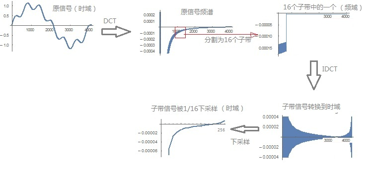
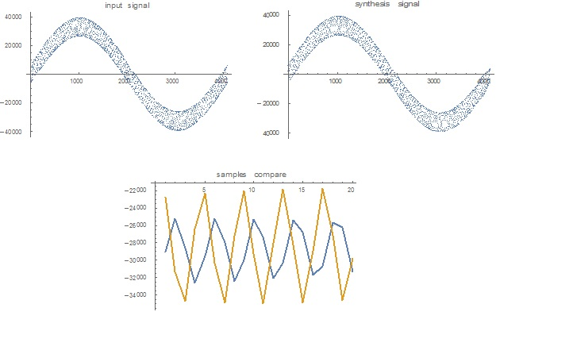

# 压缩方案一：类似DPCM编码 #

## step1：观察差值分布 ##

挑一段音频，随机抽取一秒的一组pcm数据，检查相邻两个short型采样值的差值的分布情况:

	pcm = Import["d:\\005.mp3"];
	ch=pcm[[1]][[1]][[1]];
	sr=pcm[[1]][[2]];
	Print["sample rate:", sr];
	len=Length[ch];
	data=Table[1, {i, 1,20}];
	frameSz=sr;
	Print["frame size:",frameSz];
	Do[
		start=RandomInteger[{1,len-sr}];
		data[[j]]=Table[Round[ch[[start+i]]*37767]-Round[ch[[start+i-1]]*37767], 
				{i, 2,frameSz}],
		{j,1,20}
	];
	Table[Histogram[ data[[j]] ], {j, 1, 20}]

结果为：

可以看到：

1. 近似正态分布,分布比较集中在中心点：0是中值和均值，多数情况下标准差比较大，超过100.
2. 我准备用4bit来编码这些差值，也就是编码数字为-8~7；且覆盖左右两个标准差内的点，两个标准差之外的点都截断为-7和7。那么量化步长多数情况下大于100*2/7=29。

## step2：设计与实现 ##

我设计一个DPCM压缩格式，代码在my_codec_4bit_dpcm.c中，协议如下：

1. 每一秒的pcm作为一帧，一个音频文件由多个帧组成
2. 每帧由帧头和数据部分组成
3. 每帧的帧头保存采样率、声道数、量化步长、该帧的第一个采样值(16bit)等基础信息
4. 每帧的数据部分，保存相邻采样间差值，即每个PCM与前一个PCM的差值。该差值是一个4bit的商，即pcm差值除以量化步长所得的商，可正可负。

测试后发现，音频的还原效果挺好的。

同样的，我也试了一下：

1. 用8bit来编码相邻两个采样的差值，代码在my\_codec\_8bit\_dpcm.c中
2. 用8bit来编码每个采样的值，代码在my\_codec\_8bit\_pcm.c中

还原的音质都还可以。

## step3:非均匀量化 ##

对于上面DPCM的设计，已经有一定程度上考虑非均匀量化了：

每一帧都会分析差值的分布，从而决定一个合理的量化步长，对于差值比较小的帧，量化步长也会比较小。

但是如果是将16bit PCM样本直接压缩为8bit PCM，或者直接将16bit PCM间差值压缩为4bit，可以用mu律或者A律做进一步的非均匀量化，优化信噪比。

my\_codec\_8bit\_pcm.c中有引入非均匀量化，主观测试能感受到噪声小一些。

下面是mu律的具体实现：

假设将0-32767范围的值，先经过mulaw映射到0-32767范围，然后量化到0-127之间的值。

我发现mu律对于大多数绝对值小的信号，可以有更好的信噪比，但对于个别的小信号，比均匀编码更差。

一开始我以为是我的公式不对，但参考wiki上的分段查表法也是一样的结果：

	alaw[x_]:= Log[1+255(x/32767)]/Log[1+255] * 32767;
	ialaw[x_]:= (Exp[x/32767*Log[1+255]]-1)/255*32767;
	Plot[{alaw[x], ialaw[x],x}, {x, 0, 32767}]

	answer = Solve[alaw'[x] ==1];
	x0=answer[[1]][[1]][[2]];
	Print[N[x0]]; (* x0 is seperated point*)

	ok = 0;
	Do[
		value=i;
		err1 = Abs[value - Round[value/64]*64];
		err2 =Abs[value - ialaw[Round[alaw[value]/64]*64]];
		If[err1>err2, ok=ok+1, null],
		{i, 0, Floor[x0]}
	];
	Print["ok=", ok, ",  ", N[ok/x0]]

可以看到：

1. 0到5780这段“小值”被扩大到0-22622范围，而5780到32767这段“大值”被压缩到22622-32767范围
2. 0到5780这5781个“小值”， 有75%左右的因为mu律的压扩而受益，即量化误差变小，但有25%的“小值”量化误差反而变大了。

以为是我上面的mathematica代码不对，使用[wiki](https://en.wikipedia.org/wiki/G.711)里的查表法做压扩和编码，也是这个结果：

测试用的c代码直接放出来：

	int mulaw(int x)
	{
	    int s = 0;
	    if (x < 0) { x = -x; s = 1;} 
	
	    uint32_t mask = 0xFFE0;
	    uint32_t result = 0x20;
	    uint32_t mask2 = 0x1e;
	
	
	    int i;
	    for (i = 0; i < 8; i++)
	    {   
	        if ( (x & mask) == result || (x & mask) == 0)
	        {       
	            int ret = ((x&mask2) >> (i+1)) |  (i<<4);
	            if (s)      
	            {           
	                ret = -ret;     
	            }           
	            return ret; 
	
	        }       
	        mask = (mask << 1);
	        result = (result <<1);
	        mask2 = (mask2 << 1);
	    }   
	    printf("%s:x=0x%x, exit!\n", __FUNCTION__, x); 
	    exit(-1);
	}
	int imulaw(int x)
	{
	    int s = 0;
	    if (x < 0) { x = -x; s = 1;} 
	
	    int i;
	    uint32_t tail = 1;
	    uint32_t head = 32; 
	
	    for (i = 0; i < 8; ++i)
	    {   
	        if ( ((x & 0x70) >> 4) == i)
	        {       
	            int ret = ((x & 0xf) << (i+1)) + tail + head;
	            if (s) { ret = -ret;}
	            return ret;
	        }
	        tail *=2;
	        head *=2;
	    }
	    printf("%s:x=0x%x, exit!\n", __FUNCTION__, x);
	    exit(-1);
	}
	int main(int argc, char **argv)
	{
	
	    int i;
	    int ok = 0;
	    for (i = 0; i < 5780; ++i)
	    {
	        int err1 = abs( i - imulaw(mulaw(i)));
	        int err2 = abs( i - round(i/256.0)*256);
	        if (err1 < err2)
	        {
	            ok++;
	        }
	    }
	    printf("ok = %d, %f\n", ok, ok/5780.0);
	    return 0 ;
	}

# 压缩方案二：DCT后量化再熵编码 #

根据人听力的特性，对于3k到4K频率范围的声音比较敏感，其他频率范围比较迟钝：

因此可以这样来压缩音频数据：

1. 将pcm分帧，每帧通过DCT变换到频域
2. 对于频域的数据进行量化，整体上会降低数据精度，减少bit率。例如同样的是16bit的采样精度，量化后，更多的高位变成了0。
3. 人耳敏感频段的采用小的步长，反之采用更大的量化步长。对于不敏感频段，加大量化步长，使得更多的量化结果直接为0
4. 经过上述量化处理后的数据，再采用哈夫曼等熵编码，可以有效的压缩数据

下面的代码快速验证上述方案：

将pcm做DCT变换后，量化，然后调用7zip软件进行熵编码

	ClearAll["Global`*"];
	pcm = Import["d:\\005.mp3"];

	(*different quanti size*)
	quanti[x_]= Which[x<100, 256, 
					x>=100 && x <1000, 16, 
					x>=1000&&x<6000, 4, 
					x>=6000 && x<10000, 16,
					x>=10000 && x<20000, 256,
					x>=20000, 24x/875-2048/7];
	
	sr=pcm[[1]][[2]];
	Print["sr:", sr];
	ch=pcm[[1]][[1]][[1]];
	
	len = Length[ch];
	Print["len:", len];
	qqq=Table[quanti[x], {x, 1,sr}];
	qqq[[1]] = 1;
	Print[ListLogPlot[qqq]];

	start=1;
	newch={};
	zeroCount={0,0,0};
	pcmfd="d:\\pcm.data";
	dctfd="d:\\pcmdct.data";

	While[start+sr-1<=len,
		(*get a frame, 1 second long*)
		input=Round[ch[[start;;start+sr-1]]*32767];
		start =start+sr;

		(*count zero and write to file*)
		Do[ 
			If[input[[i]] == 0,zeroCount[[1]] = zeroCount[[1]]+1, null];
			BinaryWrite[pcmfd,input[[i]], "Integer16"], 
			{i, 1,sr}
		];
		
		ddd=FourierDCT[input];
		Do[ 
			If[ddd[[i]] == 0,zeroCount[[2]] = zeroCount[[2]]+1, null], 
			{i, 1,sr}
		];
		
		(*quantify and write to file*)
		ddd2=Round[ddd/qqq];
		Do[ 
			If[ddd2[[i]] == 0,zeroCount[[3]] = zeroCount[[3]]+1, null];
			BinaryWrite[dctfd,ddd2[[i]], "Integer16"], 
			{i, 1,sr}
		];

		(* idct recovery the audio sig *)
		ddd=ddd2*qqq;
		ddd3=FourierDCT[ddd,3];
		newch=Join[newch, ddd3/32767];
	
	];
	Print["zero count:", zeroCount];
	Close[pcmfd];
	Close[dctfd];
	
	(* entropy coding *)
	Run["7z a d:\\aaa.zip d:\\pcm.data"];
	Run["7z a d:\\bbb.zip d:\\pcmdct.data"];

	(* listen and check the quality *)
	Sound[SampledSoundList[{newch, newch}, sr]]

可以看到，经过dct、quantify后，同样的熵编码压缩，大小是原来的1/3。

经过主观对比测试，语音和音乐的音质都没有明显的下降，引入了一些白噪声，应该通过一些算法可以过滤掉。

不过简单的统一采取256的量化步长，似乎也ok，就白噪声更大一点，压缩率也更大。 ：）

# 压缩方案三：分子带后量化并熵编码 #

可以这样来压缩：

1. 将pcm分帧，每一帧通过不同的带通滤波器分成很多子带
2. 每个子带采用不同的量化步长来做DPCM编码，或者
3. 每个子带DCT后，采用不同的量化步长来量化
4. 然后熵编码

先编译两个函数，一个用来初始化32个带通滤波器，一个函数用来将512个采样值分别与这32个滤波器做卷积：

	ClearAll["Global`*"];
	
	InitFilters=Compile[{},
		Module[{M,K,fc,h,i,j,kk,n},
			kk=Table[{},{i,1,32}];
			M=512;
			K=0.55;
			fc=0.01;
			h=Table[If[i==M/2,2Pi*fc*K,K*Sin[2Pi*fc*(i-M/2)]/(i-M/2)*(0.42-0.5Cos[2Pi*i/M]+0.08Cos[4Pi*i/M])],
					{i,0,M}];
			h=h[[1;;512]];
			Do[
				kk[[i+1]]=Table[h[[n+1]]*Cos[Pi*(2*i+1)*(n-16)/64],{n,0,511}],
				{i,0,31}
			];
			kk
		]
	];
	GetSuband=Compile[{{sigs, _Real, 1},{kern,_Real, 2}},
		Module[{input=sigs, hh=kern,i,pp,subs},
		
			subs = Table[{}, {i, 0, 31}];
			
			Do[
				pp=ListConvolve[ hh[[i+1]], input, 1];
				(*phase correction*)
				subs[[i+1]] = Join[pp[[275;;512]], pp[[1;;274]] ],
				{i,0,31}
			];
			
			subs
		]
	];

下面是这些带通滤波器的一些情况：

用一个信号试一下拆分后的子带信号可否合成原信号：

	input=Table[Sin[2Pi*i/512]+2Cos[20Pi*i/512]+3, {i, 1, 512}];
	Print[ListLinePlot[input, PlotLabel->"input signal"]];
	kk = InitFilters[];
	subs = GetSuband[input, kk];
	ss=Table[0, {i, 1,512}];
	
	Do[
		ss = ss + subs[[i]],
		{i, 1, 32}
	];
	Print[ListLinePlot[{ss, input}, PlotLabel->"synthesis vs input signals"]];

输入结果显示合成很成功：

然后将pcm分帧，每帧长度为512个采样值。每个帧通过带通滤波器后，每个子带采取不同的量化步长。

	pcm=Import["d:\\music.mp3"];
	
	sr=pcm[[1]][[2]];
	Print["sr:",sr];
	ch=pcm[[1]][[1]][[1]];
	
	len=Length[ch];
	Print["len:",len];
	framesz = 512;
	
	qqq={256,256,16,16,4,4,16,16,16,256,256,512,512,1024,1024,1024};
	qqq = Join[qqq, Table[1024, {i, 1,16}]];

	start=1;
	newch={};
	kk = InitFilters[];
	
	pcmfd="d:\\pcm.data";
	dctfd="d:\\pcmdct.data";

	smoothFilter={1/11,1/11,1/11,1/11,1/11,1/11,1/11,1/11,1/11,1/11,1/11,0,0,0,0,0,0,0,0,0,0,0,0,0,0,0,0,0,0,0,0,0};
	
	While[start+framesz-1<=len,
		input=Round[ch[[start;;start+framesz-1]]*32767];
		start=start+framesz;
		(* write to file*)
		BinaryWrite[pcmfd,input,"Integer16"];
		subs = GetSuband[input,kk];
		ss = Table[0, {i, 1,framesz}];
		Do[
			subs[[i]] = Round[subs[[i]]/qqq[[i]]];
			ss = ss + subs[[i]]*qqq[[i]],
			{i, 1,32}
		];

		ss = Round[ListConvolve[smoothFilter, ss, 1]];
		
		BinaryWrite[dctfd,ss,"Integer16"];
		newch=Join[newch,ss/32767];
	];
	
	Close[pcmfd];
	Close[dctfd];
	
	(*entropy coding*)
	Run["7z a d:\\aaa.zip d:\\pcm.data"];
	Run["7z a d:\\bbb.zip d:\\pcmdct.data"];
	
	(*listen and check the quality*)
	Sound[SampledSoundList[{newch,newch},sr]]

压缩效果并不明显。两个文件经过7zip压缩后都没有怎么缩小。

# 压缩方案四：子带化后下采样再量化熵编码 #

可以这样来压缩：

1. 将pcm分帧，每一帧长4096，DCT后，分为16个子带频谱，每个长255
2. 每个子带的频谱移动到0-255低频位置，IDCT到时域
3. 由于移动到低频部分了，根据那奎斯特定理，采样率不需要那么高，对子带的时域信号做下采样1/16
4. 对下采样后的子带时域信号进行量化和熵编码。 这个时候，采样数已经下降到原来的1/16，达到了压缩的目的

恢复是逆向的过程。

同样的，用一段mathematica代码快速验证一下信号恢复的效果：

	MyDownsample=Compile[{{v, _Real, 1}},
		Module[{vv = v,output},
			Table[Part[vv, x], {x, 1,256, 17}]
		]
	];

	(*
		input a signal which length is 4096, 
		output 16 subband spectram,each length is 16
	*)
	ToSuband=Compile[{{in, _Real, 1}},
		Module[{input = in,num,spect,oneband, subs, i},
			num = 4096;
			spect = FourierDCT[input];
			
			subs=Table[{}, {i, 1,16}];
			Do[
				oneband = spect[[i*256+1;;i*256+256]];(*len=256, num=16, frequency domain*)
				
				
				oneband = FourierDCT[oneband , 3];(*len=256, num=16,time domain*)
				
				oneband = MyDownsample[oneband];(*len=16, num=16,time domain*)
				
				oneband = FourierDCT[oneband ] ;(*len=16, num=16, frequency domain*)
				
				subs[[i+1]] = oneband,
				{i, 0, 15}
			];
			
			subs
		]
	
	];

	(*
		input 16 subband spectram,each length is 16
		output a signal which length is 4096, 
		
	*)

	FromSuband=Compile[{  {subband, _Real,2}},
		Module[{subs = subband,num,spect,oneband,  i},
			spect={};
			
			Do[
				oneband  =subs[[i+1]];
				oneband = FourierDCT[oneband,3] ;(*len=16, num=16, time domain*)
			
				oneband = Table[Interpolation[oneband ,p], {p, 1, 16, 1/17}];(*len=256, num=16,time domain*)
			
				oneband = FourierDCT[oneband ];(*len=256, num=16,freq domain*)
				spect = Join[spect, oneband],
				{i, 0, 15}
			];
			
			Print[Length[spect]];
			output = FourierDCT[spect, 3];
			output
		]
	];
	
	(*test two functions above*)
	input=Table[Sin[i/4096 * 2Pi]+0.2*Sin[i/4096 * 10Pi], {i, 1, 4096}];
	Print[ListLinePlot[input]];
	subs = ToSuband[input];
	Print[Length[subs],",", Length[subs[[1]] ] ];
	output=FromSuband[subs];
	ListLinePlot[{input, output}]

下面是输出结果，可以看到信号恢复的还可以。注意，直接用mathematica提供的Downsample与后面的插值函数不太对付，会导致较大的失真，所以自己写了一个下采样函数。

差点被误导了，上面的信号是低频的，所以恢复不错，对一段音频做上述操作，就完全恢复不出来，即使只做1/2下采样。

老老实实搞个信号一步一步分析吧。输入1Hz+1000Hz的合成信号。按理说4K的采样率，最多可以有2000Hz的分量频率。 画个图一步一步跟踪，想要把问题定位出来，未果：

代码有一点点修改，如下：

	ClearAll["Global`*"];
	MyDownsample = Compile[{{v, _Real, 1}},
	   
	   Module[{vv = v, output, x, index},
	    
	    index = Table[x, {x, 1, 256, 17}];
	    
	    Table[Part[vv, x], {x, index}]
	    ]
	   ];
	MyLog[v_] := Module[{input = v, output, len, z},
	   output = input;
	   len = Length[input];
	   Do[
	    If[input[[z]] > 0, output[[z]] = Log10[input[[z]]  ], null];
	    If[input[[z]] == 0, output[[z]] = 0, null];
	    If[input[[z]] < 0, output[[z]] = -Log10[-input[[z]]  ], null],
	    {z, 1, len}
	    ];
	   output
	   ];
	
	(*input a signal which length is 4096,output 16 subband spectram,each \
	length is 16*)
	ToSuband = Compile[{{in, _Real, 1}},
	   Module[{input = in, num, spect, oneband, subs, i}, num = 4096;
	    spect = FourierDCT[input];
	    subs = Table[{}, {i, 1, 16}];
	    Do[
	     oneband = spect[[i*256 + 1 ;; i*256 + 256]];(*len=256,num=16,
	     frequency domain*)
	     oneband1 = oneband;
	     oneband = FourierDCT[oneband, 3];(*len=256,num=16,time domain*)
	     oneband2 = oneband;
	     oneband = MyDownsample[oneband];(*len=16,num=16,time domain*)
	     oneband3 = oneband;
	     oneband4 = 
	      Table[Interpolation[oneband, p, InterpolationOrder -> 1], {p, 1,
	         16, 1/17}];
	     
	     
	     If[i == 3 || i == 7 || i == 0,
	      Print[
	       ListPlot[{MyLog[oneband1]}, 
	        PlotLabel -> 
	         "spect before downsample in suband #" <> ToString[(i + 1)], 
	        PlotRange -> All]];
	      Print[
	       ListPlot[{MyLog[oneband2]}, 
	        PlotLabel -> 
	         "sig before downsample in suband #" <> ToString[(i + 1)], 
	        PlotRange -> All]];
	      Print[
	       ListPlot[{MyLog[oneband3]}, 
	        PlotLabel -> 
	         "sig after downsample in suband #" <> ToString[(i + 1)], 
	        PlotRange -> All]];
	      Print[
	       ListPlot[{MyLog[oneband4]}, 
	        PlotLabel -> 
	         "sig after upsample in suband #" <> ToString[(i + 1)], 
	        PlotRange -> All]];
	      Print[
	       ListPlot[{MyLog[FourierDCT[oneband4]]}, 
	        PlotLabel -> 
	         "spect after upsample in suband #" <> ToString[(i + 1)], 
	        PlotRange -> All]],
	      null];
	     (*
	     
	     *)
	     
	     
	     oneband = FourierDCT[oneband];(*len=16,num=16,
	     frequency domain*)
	     
	     subs[[i + 1]] = oneband,
	     {i, 0, 15}];
	    subs
	    ]
	   ];
	
	(*input 16 subband spectram,each length is 16 output a signal which \
	length is 4096,*)
	
	FromSuband = Compile[{{subband, _Real, 2}},
	   Module[{subs = subband, num, spect, oneband, i}, spect = {};
	    Do[oneband = subs[[i + 1]];
	     oneband = FourierDCT[oneband, 3];(*len=16,num=16,time domain*)
	     oneband = 
	      Table[Interpolation[oneband, p], {p, 1, 16, 1/17}];(*len=256,
	     num=16,time domain*)
	     
	     oneband = FourierDCT[oneband];(*len=256,num=16,freq domain*)
	     spect = Join[spect, oneband], {i, 0, 15}
	     ];
	    output = FourierDCT[spect, 3];
	    output
	    ]
	   ];
	
	(*test two functions above*)
	input = Table[(Sin[i/4096*2 Pi] + 
	      0.2*Sin[i/4096*2 Pi*1000])*32767, {i, 1, 4096}];
	inputdct = FourierDCT[input];
	Print[ListPlot[input, PlotLabel -> "input signal"]];
	Print[ListPlot[MyLog[inputdct], PlotLabel -> "input signal spectram"]];
	subs = ToSuband[input];
	Print[Length[subs], ",", Length[subs[[1]]]];
	output = FromSuband[subs];
	
	ListLinePlot[{input, output}]
