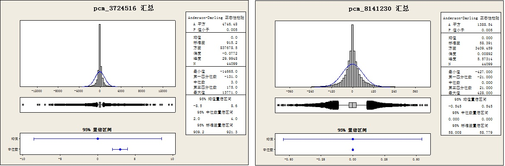

# 自己实现DPCM编码 #

先挑一段音频，随机抽取一秒的一组pcm数据，检查相邻两个short型采样值的差值的分布情况，总共观察了7组。 

可以看到：

1. 这些采样间差值符合正态分布，平均值和中值为0，标准差有： 520，58，1741，615，915等等
2. 很难理解DM编码，只用1个bit位表示差值能够较好的还原音频，量化步长和量化误差应该都很大，除非采样率非常非常高。

下面是其中两组数据的分布情况：

下面是产生上述pcm数据差值的mathematica代码，当然，检查他们的分布，还借助了minitab软件：

	pcm = Import["d:\\005.mp3"]；
	ch = pcm[[1]][[1]][[1]];
	sr = pcm[[1]][[2]];
	sr
	len = Length[ch];
	
	Do[
		 start = RandomInteger[{1, len - sr}];
		 filename = "d:\pcm_" <> ToString[start] <> ".txt";
		 fd = OpenWrite[filename];
		 Write[fd, "pcm_" <> ToString[start]];
		 Do[
			  Write[fd, 
			   Round[ch[[start + i]]*37767] - Round[ch[[start + i - 1]]*37767 ]],
			  {i, 2, sr}
		  ];
		 Close[fd],
		 {j, 1, 10}
	 ]

我设计一个DPCM压缩格式，代码在my_codec.c中，协议如下：

1. 每一秒的pcm作为一帧，一个音频文件由多个帧组成
2. 每帧由帧头和数据部分组成
3. 每帧的帧头保存采样率、声道数、量化步长、该帧的第一个采样值(16bit)等基础信息
4. 每帧的数据部分，保存相邻采样间差值，即每个PCM与前一个PCM的差值。该差值是一个4bit的商，即pcm差值除以量化步长所得的商，可正可负。

测试后发现，音频的还原效果较差，很多语音句子都听不清了。不出所料，毕竟很多帧的量化步长达到了200甚至更大，可见引入的量化误差相当大。
