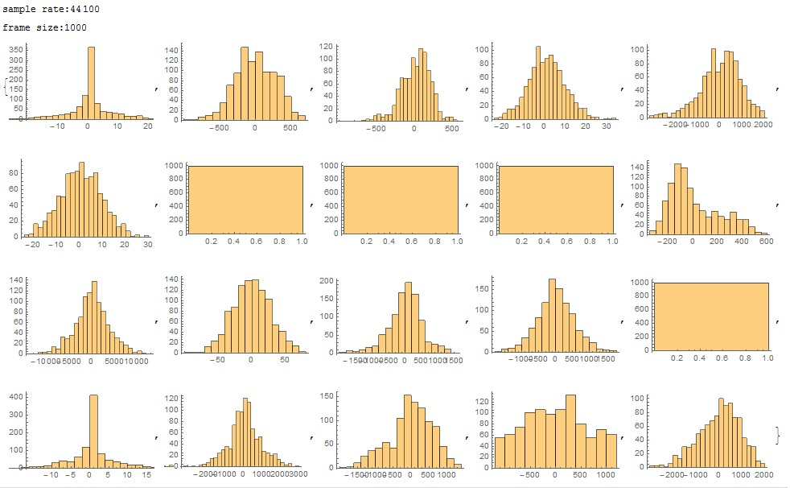

# 自己实现DPCM编码 #

## step1：观察差值分布 ##

挑一段音频，随机抽取一秒的一组pcm数据，检查相邻两个short型采样值的差值的分布情况:

	pcm = Import["d:\\005.mp3"];
	ch=pcm[[1]][[1]][[1]];
	sr=pcm[[1]][[2]];
	Print["sample rate:", sr];
	len=Length[ch];
	data=Table[1, {i, 1,20}];
	frameSz=sr;
	Print["frame size:",frameSz];
	Do[
		start=RandomInteger[{1,len-sr}];
		data[[j]]=Table[Round[ch[[start+i]]*37767]-Round[ch[[start+i-1]]*37767], 
				{i, 2,frameSz}],
		{j,1,20}
	];
	Table[Histogram[ data[[j]] ], {j, 1, 20}]

结果为：

可以看到：

1. 近似正态分布,分布比较集中在中心点：0是中值和均值，多数情况下标准差比较大，超过100.
2. 我准备用4bit来编码这些差值，也就是编码数字为-8~7；且覆盖左右两个标准差内的点，两个标准差之外的点都截断为-7和7。那么量化步长多数情况下大于100*2/7=29。

## step2：设计与实现 ##

我设计一个DPCM压缩格式，代码在my_codec.c中，协议如下：

1. 每一秒的pcm作为一帧，一个音频文件由多个帧组成
2. 每帧由帧头和数据部分组成
3. 每帧的帧头保存采样率、声道数、量化步长、该帧的第一个采样值(16bit)等基础信息
4. 每帧的数据部分，保存相邻采样间差值，即每个PCM与前一个PCM的差值。该差值是一个4bit的商，即pcm差值除以量化步长所得的商，可正可负。

测试后发现，音频的还原效果较差，很多语音句子都听不清了。不出所料，毕竟很多帧的量化步长达到了100甚至更大，量化误差占信号值本身的百分比达到18%：

	...
	cut:4223, avg_abs:3292.07, step_size:603, step_size/avg_abs:18.32%
	cut:2558, avg_abs:3505.46, step_size:365, step_size/avg_abs:10.41%
	cut:1129, avg_abs:1059.11, step_size:161, step_size/avg_abs:15.20%
	cut:650, avg_abs:1915.04, step_size:93, step_size/avg_abs:4.86%
	cut:1727, avg_abs:1867.59, step_size:247, step_size/avg_abs:13.23%
	...

是不是减小帧的大小，例如每个帧处理1000个连续采样值，可以非常有效的减少差值呢？  答案是否定的：

真不知道DM编码方式是怎么用一个bit来表示差值的，不会引入很大的量化误差吗？ 或者需要非常非常高的采样频率，以减小相邻两个采样的差值。

看来，我只好增加每个差值的位宽了。