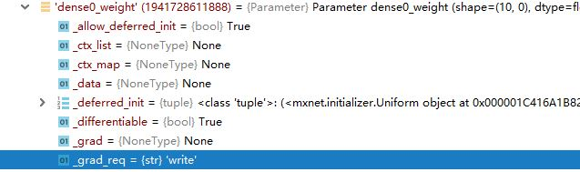
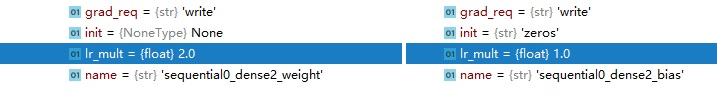
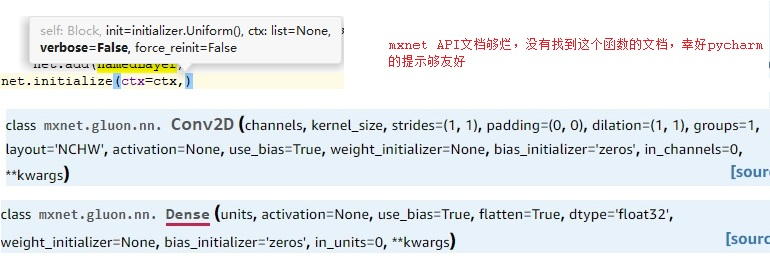

### 多批次的梯度累加

mxnet gluon不需要像pytorch caffe那样手动清零梯度，因为新梯度默认是写进去，而不是累加。

对于小显存显卡的小批量数据的训练，可以多次批量累加梯度，模拟出大显存大批量的效果：

```python
#默认是write，改为累加
for p in net.collect_params().values():
    p.grad_req="add"
# ... 
# 在每次trainer.step更新参数后，将梯度清零。step的batchsz参数要做适当的修改
        if (i%2)==0 and i != 0:
            trainer.step(batch_size*2) # update the wb parameters
            net.collect_params().zero_grad()
```



可以这样来访问梯度和参数值等数据：

```python
print(namedLayer.weight.shape)
print(namedLayer.weight.data(ctx=ctx)[0,1])
print(namedLayer.weight.grad(ctx=ctx)[0,1])
print(namedLayer.bias.grad(ctx=ctx)[0])
```

默认情况下不需要手动清理梯度，但mxnet的网络的参数需要手动调用initialize()函数来初始化，或者load_parameters()从参数文件中加载。

### 学习率、学习率倍数等超参数

可以这样来修改某参数的学习率倍数，默认是1.0：

```python
namedLayer.weight.lr_mult = 2.0
```



Trainer（感觉对应caffe的solver）初始化的时候可以指定很多超参数：

```python
#第三个字典类型的参数可以设置：
#learning_rate, wd (weight decay), clip_gradient, and lr_scheduler.
trainer = gluon.Trainer(net.collect_params(), "sgd", {"learning_rate":0.1,"wd":0.0001})
#单独为lr有个函数，其他超参数没有这个待遇，例如没有set_wd哈
trainer.set_learning_rate(lr) 
```

网络在初始化函数里可以指定整个网络的参数随机初始方法，默认为均匀分布。

各层在创建的时候也可以指定自己的初始化方法，包括以下参数：

1. output number
2. 激活函数
3. 参数初始化方法
4. 数值类型等等

以全连接层和卷积层为例：



详细见API文档：

```
https://mxnet.incubator.apache.org/api/python/index.html
```

### 自定义的数据读取方式

假设训练数据是来自我们自己形态比较特殊的数据源，例如log文件。那怎么做呢？

1. 自定义类继承自 mxnet.gluon.data.Dataset
2. 实现\_\_getitem\_\_ 和\_\_len\_\_ 函数
3. 创建该自定义类的实例，用做gluon.data.DataLoader实例的参数

下面是一个简单例子：

```python
import mxnet.gluon.data as data
import mxnet.ndarray as nd

num_examples = 1000
num_inputs = 2

X = nd.random_normal(shape=(num_examples, num_inputs))
noise = 0.01 * nd.random_normal(shape=(num_examples,))
y = 2 * X[:, 0] - 3.4 * X[:, 1] + 4.2 + noise
XY = data.ArrayDataset(X, y)

class MyFileDataset(data.Dataset):
    def __init__(self):
        return

    def __getitem__(self, item):
        return XY[item]
    def __len__(self):
        return num_examples
```

然后：

```pyton
train_data = gluon.data.DataLoader(MyFileDataset(), batch_size=batch_size, shuffle=True)
```

### 自定义layer

gluon.Block是mxnet里非常重要的类，重要性与NDArray不相上下。

自定义layer就是写一个继承Block的子类，具体做法：

```
https://gluon.mxnet.io/chapter03_deep-neural-networks/custom-layer.html#Defining-a-(toy)-custom-layer
```

### Train mode and predict mode

数据在net中前向传播的时候，有两种模式，train mode和predict模式，mxnet默认是predict模式。例如这段代码就是predict模式，打印显示false：

```python
ctx=mx.gpu(0)
class MLP(gluon.Block):
    def __init__(self, **kwargs):
        super(MLP, self).__init__(**kwargs)
        with self.name_scope():
            self.dense0 = gluon.nn.Dense(64)
            self.dense1 = gluon.nn.Dense(64)
            self.drop0 = gluon.nn.Dropout(0.5)
            self.dense2 = gluon.nn.Dense(10)

    def forward(self, x):
        x = nd.relu(self.dense0(x))
        x = nd.relu(self.dense1(x))
        x = self.drop0(x)
        x = self.dense2(x)
        return x

net = MLP()
net.load_parameters('e:/softmax.params', ctx=ctx)
inputdata = nd.ones(shape=(64,784),ctx=ctx)
net(inputdata)
print(autograd.is_training())
```

autograd.record()函数的第一个参数就是指定是否是training_mode，默认值为True。

模式会影响Dropout层，当predict_mode时，Dropout层不工作，可以用下面的代码验证：

```python
net = MLP()
net.initialize(ctx=ctx)

inputdata = nd.array([[1,2,3,4]],ctx=ctx)
with autograd.train_mode():
    output = net(inputdata)
    print(output)
    output = net(inputdata)
    print(output)
exit(0)
```

当train mode的时候，由于dropout随机丢弃一些节点值，所以两次output的值不一样；如果是predict mode，两次output的值就是一样的。

在Caffe里，Dropout层的逻辑也是这样的，非Train模式不工作：

```c++
if (this->phase_ == TRAIN) {
    // Create random numbers
    caffe_rng_bernoulli(count, 1. - threshold_, mask);
    for (int i = 0; i < count; ++i) {
      top_data[i] = bottom_data[i] * mask[i] * scale_;
    }
  } else {
    caffe_copy(bottom[0]->count(), bottom_data, top_data);
  }
```


### 坑

1、ndarray之间的相互运算，例如两个nd相加，他们的dtype要求一致，否则报错，类似这样的：

```
Incompatible attr in node  at 1-th input: expected int32, got float32
```

### 不错的文档

```
http://zh.gluon.ai/index.html
https://gluon.mxnet.io/
```